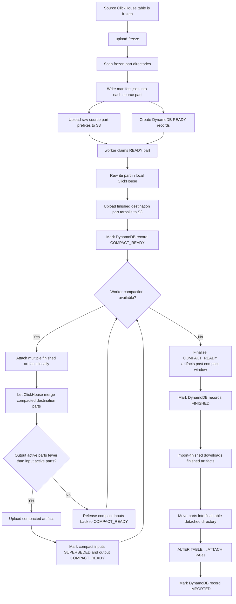
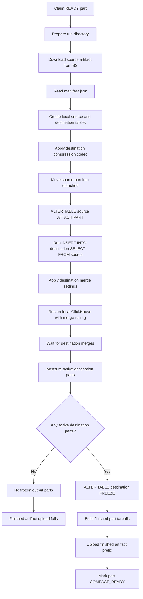
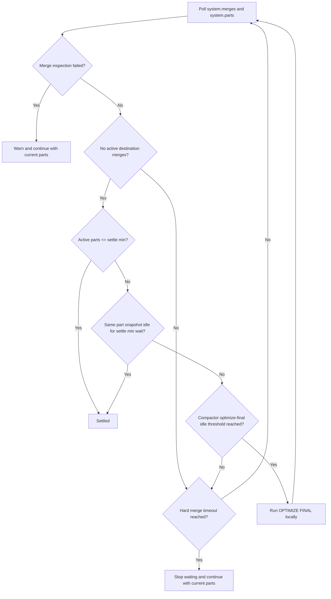

# Rewrite Flow

This document describes the current part rewrite procedure. Source rewrites produce compact-ready artifacts first. Workers then opportunistically compact those artifacts when no source rewrite work is ready, or finalize the remaining compact-ready artifacts after the configured compaction window.

Compaction primarily relies on normal MergeTree background merges in local worker ClickHouse processes. While the compactor is still waiting for merges, if a compact destination table has a stable multi-part output with no merge activity for 30 seconds, the compactor runs `OPTIMIZE TABLE ... PARTITION ID ... FINAL` once for each local destination partition that still has multiple active parts.

## Job-Level Flow

## Worker Part Flow

The insert-select step has its own resource retry loop. The worker caps query memory at 70% of detected memory, then initially sets `max_threads` and `max_insert_threads` to the lower of about one quarter of the detected CPU count and a memory-derived limit that targets at least 2 GiB insert blocks when memory allows. It derives `min_insert_block_size_bytes` from the insert memory cap divided by six times the insert thread count, then derives `min_insert_block_size_rows` from that byte target using a 1 KiB average-row estimate. If ClickHouse returns a retryable resource error such as memory pressure or too many threads, the worker halves `max_insert_threads` and, when present, `max_threads`; drops and recreates the destination table; reapplies only the destination compression codec; waits with a short backoff; and retries the insert-select. Destination merge settings are applied only after the insert-select succeeds.

## Destination Merge Settings

After a successful insert-select and before the ClickHouse restart, the worker applies these destination table settings:

- `merge_max_block_size`
- `merge_max_block_size_bytes`
- `merge_selecting_sleep_ms`
- `max_bytes_to_merge_at_max_space_in_pool`
- `max_bytes_to_merge_at_min_space_in_pool`

## Merge Wait

`-merge-idle-timeout` is an inactivity window used to check whether the destination has reached the merge target. It is extended when ClickHouse has active destination merges or when the destination part snapshot changes. `-merge-max-runtime` is the hard cap for the whole wait. When worker compaction is enabled, the initial source rewrite merge wait is capped at 5 minutes because later compaction work is responsible for deeper consolidation. The compaction path uses `-compact-merge-idle-timeout` and `-compact-merge-max-runtime` with the same semantics.

If the hard merge wait times out or merge-wait inspection fails, that is not a rewrite failure. The worker logs the reason and continues with whatever active destination parts exist. Any destination with more than one active output part must keep the same part snapshot idle for the derived settle wait and have no partition with a pair of active parts that can merge under the 150 GiB target before the worker treats merges as settled.

## Worker Compaction

When `worker -compact=true` finds no `READY` source part, it waits for a small derived random splay and then tries to claim `COMPACT_READY` artifacts for the same job, bucket, destination table, and destination schema. The claim picker is partition-aware: it only claims a partition when the selected artifacts have enough active parts in that destination partition, and it can add multiple eligible partitions to one batch until the configured artifact or byte limit is reached. It does not count unrelated one-part partitions as compactable work. If other workers are already compacting some partitions for the same destination, the picker tries partitions that are not currently compacting first, then falls back to those busy partitions when no other compactable partition exists.

The compactor downloads and attaches the whole claimed batch before starting the merge wait. ClickHouse assigns attached part names, so the worker does not rename parts before attach. Compaction configures MergeTree merge settings, restarts the local ClickHouse with merge tuning, and lets normal background merges choose what to merge. If the merge wait is still active and those merges sit idle for 30 seconds, the compactor finds local destination partitions with more than one active part and at most 150 GiB of total active bytes, runs `OPTIMIZE FINAL` for those partition IDs only, and then resumes the same merge wait. If every partition already has at most one active part or is too large for target-sized optimize final, the worker skips the optimize attempt for that stable snapshot.

The compact output is uploaded only if the final active output part count is lower than the active input part count. If compaction does not reduce the count, the worker releases the inputs back to `COMPACT_READY`. The finalization window is measured from the newest current `COMPACT_READY` or `COMPACTING` timestamp. Successful compact outputs inherit the newest input compact-ready timestamp, so deeper compaction does not extend the job-level window automatically. A single artifact larger than `-compact-max-bytes` remains eligible when it already contains enough physical parts to compact; the byte cap only stops adding more artifacts to a batch.

Live compaction workers heartbeat their claimed `COMPACTING` rows. Before claiming more compaction work, workers release `COMPACTING` rows whose heartbeat is stale for the derived lease timeout, currently `-compact-merge-max-runtime` with a 5 minute floor. Once a job's compact window has expired, workers stop claiming new compact work for that job. Remaining compact-ready artifacts are promoted to `FINISHED` once there is no source work, in-progress rewrite, failed work, or active non-stale compaction for that job. A single remaining compact-ready output is finalized immediately when it has one physical ClickHouse part, belongs to exactly one destination partition, and no other current output rows remain.

`job-status` physical part counters refer to ClickHouse parts, not PartForge state rows. Source rows count the attached source part or persisted rewritten destination part count. Compact rows count the physical destination parts that fed that compact output. Live `COMPACTING` rows report the physical parts actually attached into the local compact table as input and the latest active local ClickHouse parts as output while merges are still running. The compact summary reports finalization blockers and ETA; `job-status -parts` shows each compact-ready row's age and destination partitions.

## Resetting Compaction State

Compaction lineage is stored in both directions. Generated compact rows record their direct inputs in `compact_input_part_ids`; input rows record the replacement output in `superseded_by`. `reset-job` and `reset-compaction` load the full job, validate that existing generated rows reference existing inputs, reject cycles and import-started rows, delete generated compact rows, and then restore original source rows.

`reset-job` restores original rows to `READY`, clearing rewrite and compaction progress so workers rerun the source rewrite from the uploaded source artifact. `reset-compaction` restores original rows to `COMPACT_READY`, preserving their rewritten artifact metadata so workers rerun only the compaction stage. With `-delete-s3`, `reset-job` deletes generated compact artifacts and original rewritten `finished/` artifacts but not uploaded `source/` artifacts; `reset-compaction` deletes only generated compact artifacts.

## Failed Merge Count

Before measuring and freezing destination parts, the worker flushes ClickHouse logs and counts failed destination `MergeParts` events in `system.part_log`. The count is persisted as `destination_failed_merges`, rolled up in `job-status`, and shown per part as `FAILED_MERGES` in `job-status -parts`.

If that diagnostic query fails and the worker context was not canceled, the worker logs the diagnostic failure and continues. This counter is for visibility into merge contention or merge errors; it does not decide whether the rewrite succeeds.

## What Gets Frozen

The worker freezes the active destination parts that exist after the merge wait. A single output source part may therefore produce one destination part or several destination parts.

The worker currently expects at least one frozen destination part to upload. If the insert-select writes no rows and no active destination parts exist, the rewrite reaches the no-output path and the finished artifact upload fails rather than marking an empty result finished.
