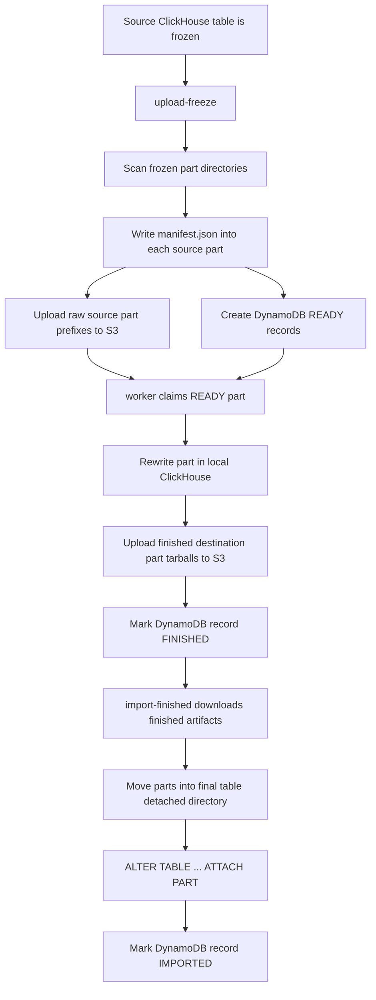
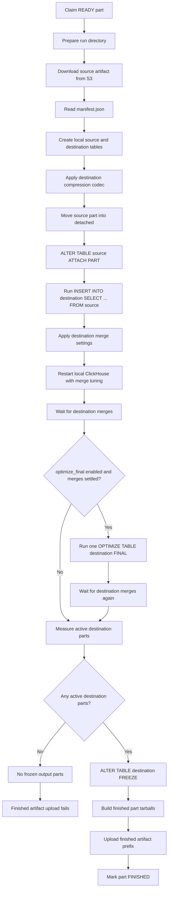
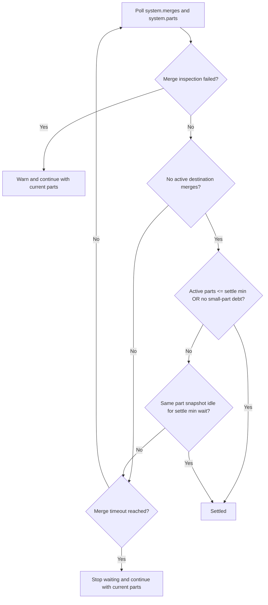

# Rewrite Flow

This document describes the current part rewrite procedure. There is one worker path; `optimize_final` is an optional step inside that path.

`OPTIMIZE TABLE ... FINAL` only runs inside the local worker ClickHouse process. PartForge never runs `OPTIMIZE FINAL` on the source/upload host or the final import host.

## Job-Level Flow

`upload-freeze -optimize-final` stores `optimize_final: true` in each manifest and affects the derived job and part IDs. `worker -optimize-final` ignores the manifest option and enables the same optional optimize step for every part processed by that worker.

## Worker Part Flow

The insert-select step has its own resource retry loop. If ClickHouse returns a retryable resource error such as memory pressure or too many threads, the worker halves `max_insert_threads` and, when present, `max_threads`; drops and recreates the destination table; reapplies only the destination compression codec; waits with a short backoff; and retries the insert-select. Destination merge settings are applied only after the insert-select succeeds.

## Destination Merge Settings

After a successful insert-select and before the ClickHouse restart, the worker applies these destination table settings:

- `merge_max_block_size`
- `merge_max_block_size_bytes`
- `merge_selecting_sleep_ms`
- `max_bytes_to_merge_at_max_space_in_pool`
- `max_bytes_to_merge_at_min_space_in_pool`
- `enable_vertical_merge_algorithm = 0`

The last setting forces horizontal merges.

## Merge Wait

If the merge wait times out or merge-wait inspection fails, that is not a rewrite failure. The worker logs the reason and continues with whatever active destination parts exist.

Small-part debt means the destination table has more than one active part and more than `-merge-small-part-max-count` active parts below `-merge-small-part-bytes`. The default small-part threshold is 1 GiB and the default allowed small-part count is 2.

## Optional optimize_final Step

There is no separate optimize-final path and no normal-path fallback. If `optimize_final` is enabled, the worker first waits for destination merges to settle. If that wait settles, it runs one local `OPTIMIZE TABLE ... FINAL`, then waits for destination merges again before measuring and freezing parts.

If the first merge wait does not settle or cannot inspect merge state, the worker skips `OPTIMIZE FINAL` and continues with the current destination parts. If the optimize request itself returns an error and the worker context was not canceled, the worker logs the error and still performs the second merge wait. ClickHouse may still have started merge work before the client saw an error.

The optimize request uses `send_timeout=0` and `receive_timeout=0`, and does not use `optimize_throw_if_noop=1`. It is not retried, it does not inspect `system.part_log`, and it does not require the table to end with one active part.

## What Gets Frozen

The worker freezes the active destination parts that exist after the merge wait, optional `OPTIMIZE FINAL`, and optional post-optimize merge wait. A single output source part may therefore produce one destination part or several destination parts.

The worker currently expects at least one frozen destination part to upload. If the insert-select writes no rows and no active destination parts exist, the rewrite reaches the no-output path and the finished artifact upload fails rather than marking an empty result finished.
